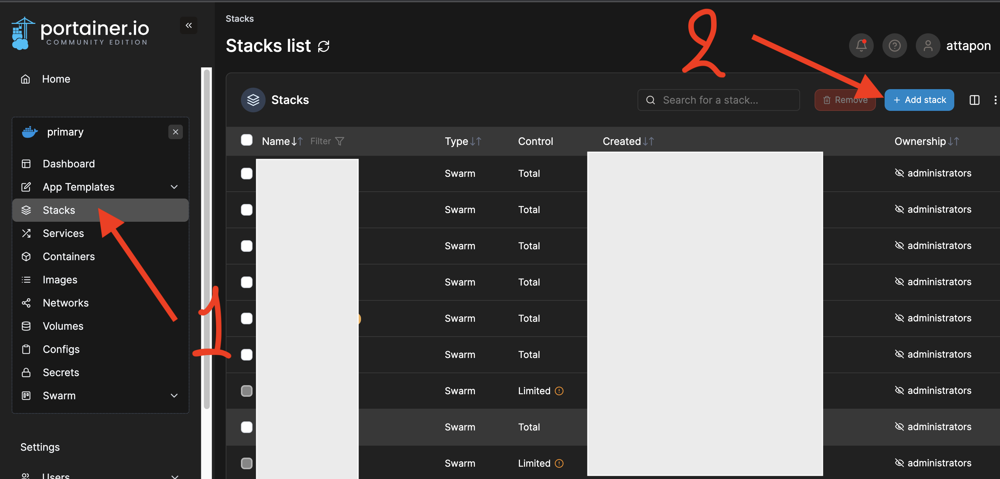
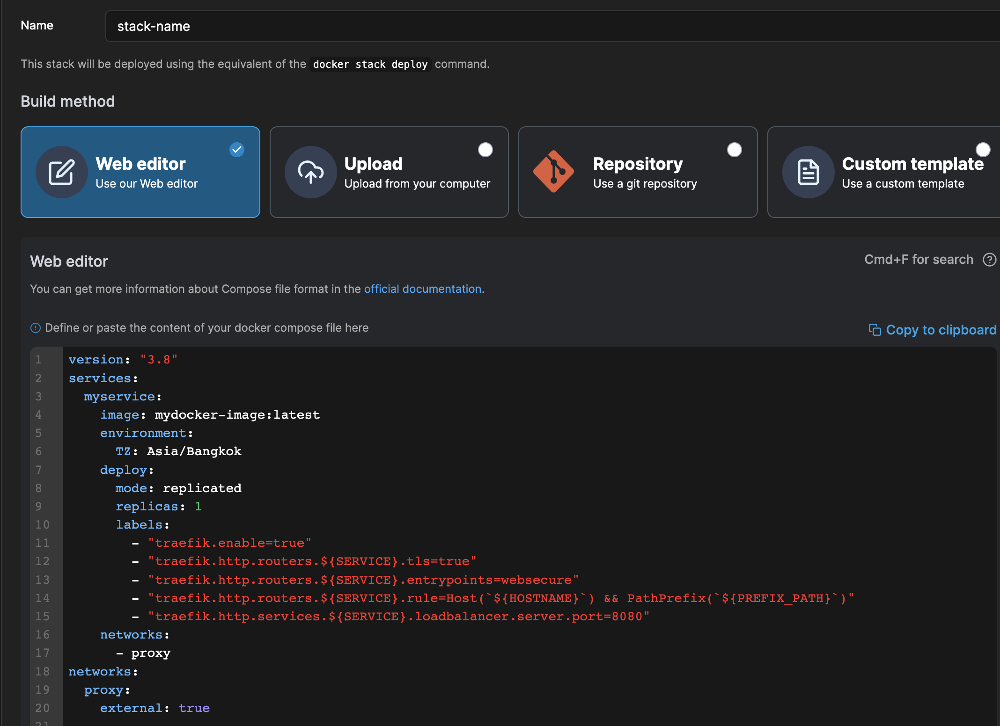

# Docker Images 

> this docker images are created for `Docker stack`

## Project Support (Required)

1. [traefik-setup](https://github.com/attapon-th/traefik-setup)  
2. [portainer](https://github.com/attapon-th/portainer)
3. [taskfile.dev](https://taskfile.dev/) - (help command line)

## List

- [x] [Keycloak](./keycloak/) 
- [x] [Jupyter HUB](./juptyerhub/) 
- [x] [N8N Workflow](./n8n/) 
- [ ] [Airflow](./airflow/) (only use docker compose)
- [x] [Superset](./superset/)

---

- [x] [minio.yaml](./minio-stack.yml)
- [x] [filebrowser.yaml](./filebrowser-stack.yml)
- [x] [docker-registry.yaml](./docker-registry.yml)

## How to Deploy with Portainer

> request `docker swarm` mode
>
> request `portainer` to be installed
>
> request `docker-compose` to be installed
>

1. Use deploy docker stack with portainer ui  

  

2. config with `docker compose` version: 3

 

