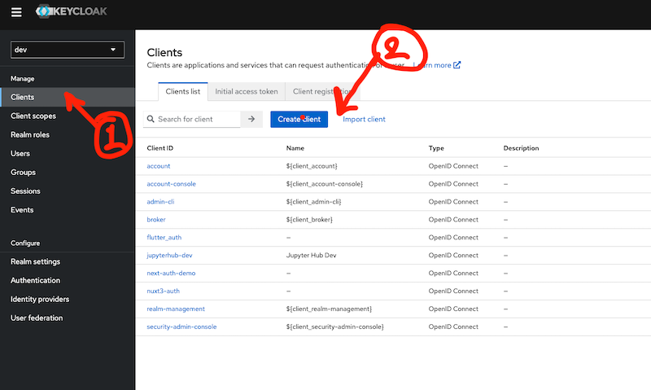
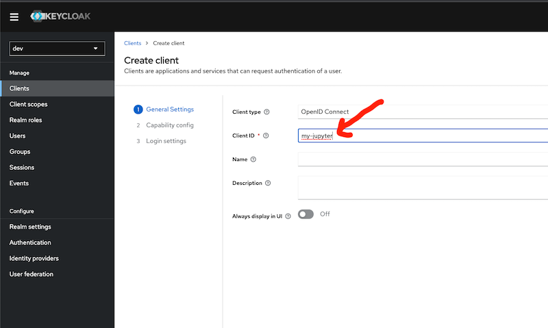
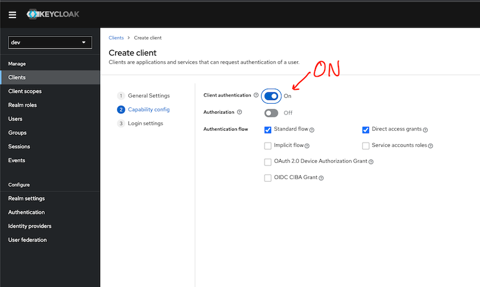
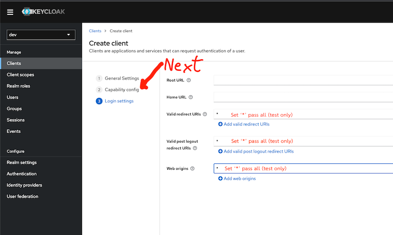
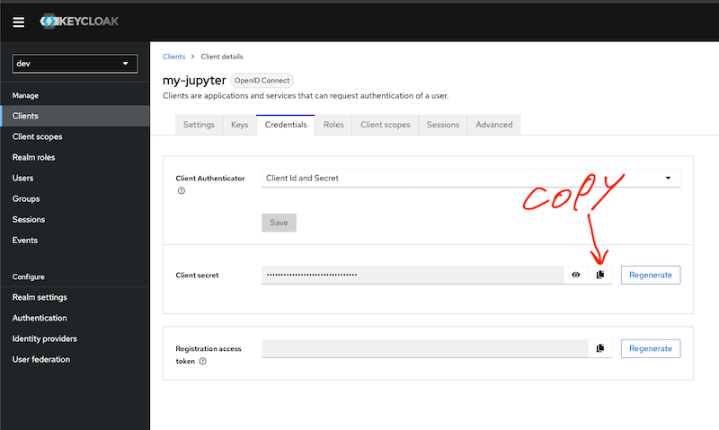
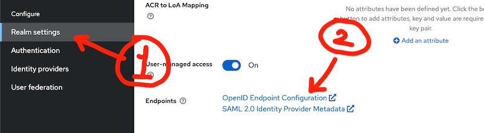

# Jupyter HUB on Docker Swarm

### ***Not Fully Tested

## Prerequisites

- Install Docker [https://docs.docker.com/engine/installation/](https://docs.docker.com/engine/installation/)

- Start Docker Swarm
    ```shell
    docker swarm init
    ```

## Setup Keycloak (test only)
- Create Client   
    
    - Clinet name: `my-jupyter`   
    
    - Turn on client authentication   
    

    - Setup Valid Redirect URIs  
    
        - Valid redirect URIs: `*`
        - Valid post logout redirect URIs: `*`
- Get ClientID and Client Secret (Page: `Clients > Client details`)
    - client_id: `my-jupyter`
    - client_secret: get from tab `Credentials` in field `Client secret`  
    

- Get KEYCLOAK_OPENID_CONFIG_URL  
    

## Deploy Jupyter HUB

- Clone this repository
    ```shell
    git clone https://github.com/attapon-th/docker-jupyterhub-keycloak.git

    cd docker-jupyterhub-keycloak
    ```
- Build docker image
    ```shell
    # image jupyter hub
    docker build -f jupyterhub/Dockerfile -t jupyterhub-keycloak:latest ./jupyterhub 

    # image jupyter lab
    docker build -f jupyterlab/Dockerfile -t jupyterlab:latest ./jupyterlab
    ```

- Create a network for the Jupyter HUB
    ```shell
    docker network create --driver overlay --attachable jupyterhub_swarm_network
    ```

- Create a volume for the Jupyter HUB
    ```shell
    docker volume create jupyterhub_data
    ```

- Deploy jupyter hub with docker stack

    > Note: You can change the environment variables in the file `jupyterhub-keycloak-stack.yml` to suit your needs. 
    >   
    > **Required environment variables:**
    > - `DOCKER_NETWORK_NAME`
    > - `JUPYTERHUB_CRYPT_KEY`
    > - `JUPYTERHUB_HOST`
    > - `JUPYTERHUB_BASE_URL`
    > - `KEYCLOAK_OPENID_CONFIG_URL`
    > - `OAUTH2_CLIENT_ID`
    > - `OAUTH2_CLIENT_SECRET`

    ```shell
    docker stack deploy -c jupyterhub-keycloak-stack.yml jupyterhub
    ```
- Open Jupyter HUB in your browser
    ```shell
    http://localhost:8000

    # or

    http://<your-ip-address>:8000

    # or

    http://<your-domain-name>:8000
    ```
