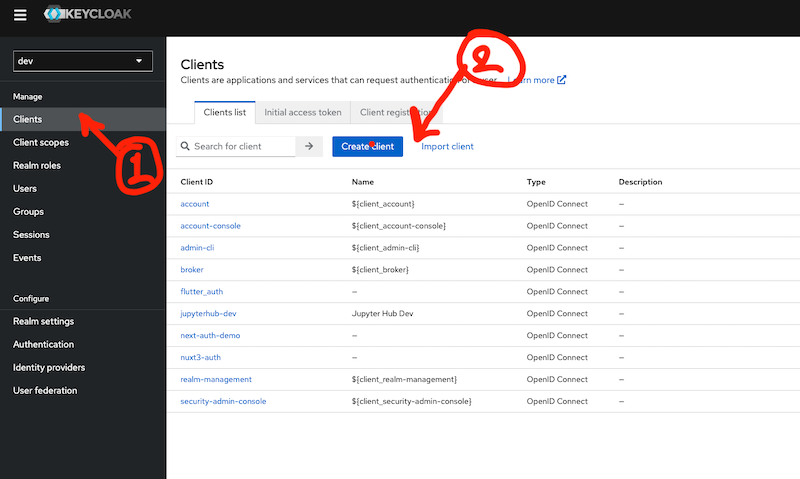
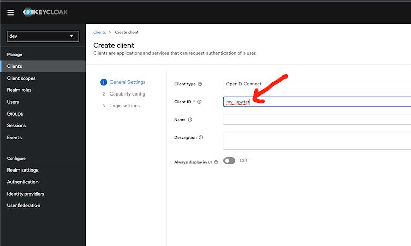
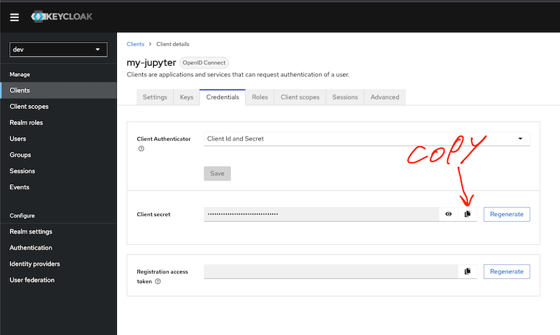

# Setup Keycloak for jupyter hub

## Create Client for Jupyter hub 

  - Create Client   
  - 
  - 
  - Create Client name
  -  
  -  
  - Turn on client authentication   
  - 
  - 
  - Setup Valid Redirect URIs  
  -   
  - Valid redirect URIs: `*`
  - Valid post logout redirect URIs: `*`
  - 
  - Get ClientID and Client Secret (Page: `Clients > Client details`)
    - client_id: `my-jupyter`
    - client_secret: get from tab `Credentials` in field `Client secret`  
  - 

- Get KEYCLOAK_OPENID_CONFIG_URL  
- 

## Create `Role` and `Scope`

- Create Client Role for Jupyter hub Role (`jupyter-user` and `jupyter-admin`)
- 

- Create `Scope`
- 

- Create Client role name: `client_roles`
- 

- Add Mapper Roles for `client_roles`
- 

- Add Mapper Roles
-   
- 

- Add scopes `client_roles` to `client`
- 
- 

# Success Config keycloak